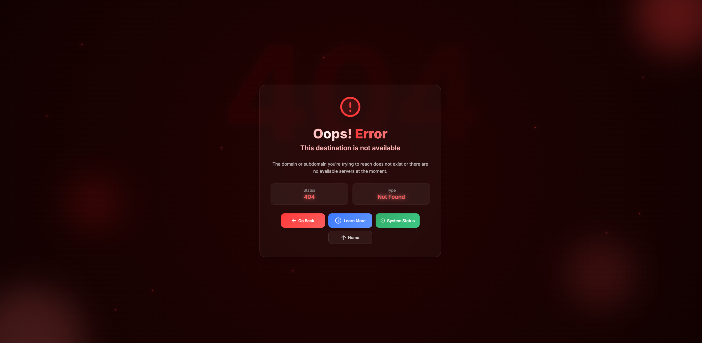
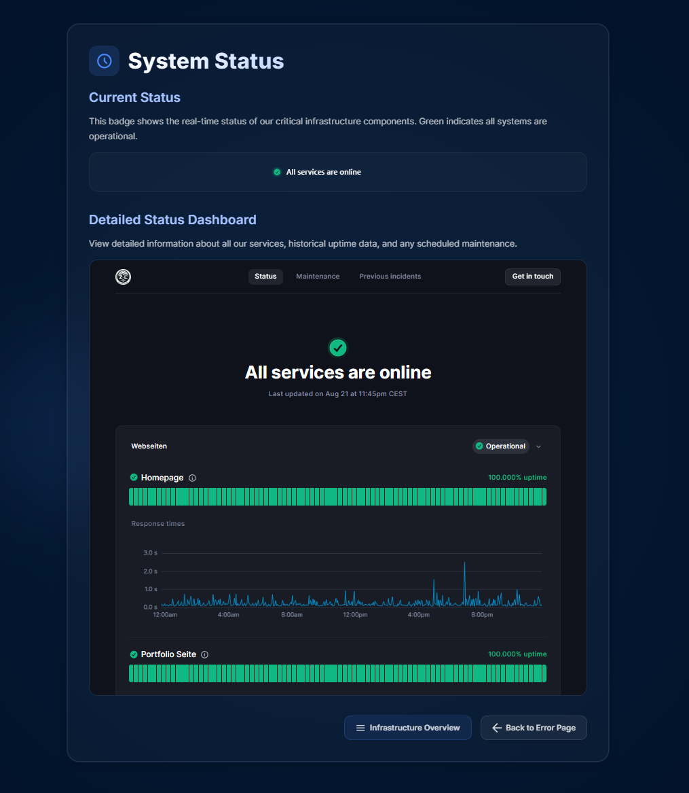

# 🚀 **Error Page Project**

Welcome to the **Error Page** for zacklack.de, a beautifully designed and responsive error page built with **Astro**.

  

## 🌟 **Features**

- **Elegant Design**: A visually stunning error page with a glassmorphism-inspired UI.
- **Responsive Layout**: Fully optimized for desktop and mobile devices.
- **System Status Integration**: Embedded status monitoring powered by Uptime Kuma.

## 🛠️ **Getting Started**

Follow these steps to set up and run the project locally:

### 1️⃣ **Clone the Repository**

```sh
git clone https://github.com/zzackllack/error-page.git
cd error-page
```

### 2️⃣ **Install Dependencies**

```sh
npm install
```

### 3️⃣ **Run the Development Server**

```sh
npm run dev
```

Your site will be live at `http://localhost:4321`.

## 🧞 **Available Commands**

| Command                   | Action                                           |
| :------------------------ | :----------------------------------------------- |
| `npm install`             | Installs dependencies                            |
| `npm run dev`             | Starts local dev server at `localhost:4321`      |
| `npm run build`           | Builds the production site to `./dist/`          |
| `npm run preview`         | Previews the production build locally            |
| `npm run astro ...`       | Runs Astro CLI commands                          |
| `npm run astro -- --help` | Displays help for Astro CLI                      |

## 🌐 **Live Demo**

Check out the live demo of the project:  
[**Live Demo Link**](https://error.zacklack.de)

## 🛡️ **System Status**

This project integrates with **Uptime Kuma** for real-time system monitoring.  


## 📜 **License**

This project is licensed under the [BSD 3-Clause License](./LICENSE).

## 👀 **Learn More**

- [Astro Documentation](https://docs.astro.build)
- [Astro Discord Community](https://astro.build/chat)
